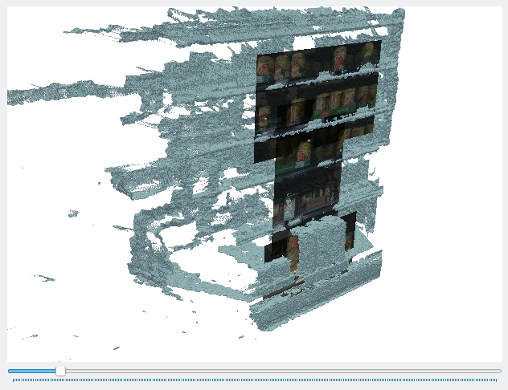

# METRALABS Kickelhack Challenge

## Setup

We have prepared a setup script which will automatically set up your development environment. The script does two things:

    - Create a Python virtual environment (venv) and install required packages within the venv.
    - Activate the Python virtual environment.

Your system Python packages will be untouched. Once you are done with the challenge, you can delete the `.venv` directory and the packages will be gone.

### Skipping the Automatic Setup

If you want to manage your environment yourself, just install the `metralabs` package using pip:

```bash
pip install -e path/to/this/folder
```

You can now skip to the **Verify the Environment** section.

### First Time Setup

The first time you run the setup script, the script will detect your system Python installation, but you can specify a different interpreter by setting ``METRALABS_PYTHON``:

```bash
# optional
export METRALABS_PYTHON=/path/to/python
```
or 

```bash
# optional
export METRALABS_PYTHON=python3.11
```

Now run 

```
source ./scripts/setup
```

to create the virtual environment and install required packages.


### Reactivating

To re-activate the environment, simply run ``source scripts/setup`` again. Unless you have deleted your ``.venv`` directory, the command should pretty much return immediately and the required environment variables and packages should be available. 

### Verify the Environment

Run ``./scripts/test_installation`` to verify your environment.

## Datasets

We provide you with a couple of datasets, each contained within a folder. These contain camera images, point clouds, and 3D pose information. You can visualize your data using the `metralabs.gui` module:

```bash
python -m metralabs.gui path/to/dataset
```

The GUI allows you to visualize the dataset, merging messages that are captured roughly at the same time. Feel free to edit the GUI to visualize your solutions or anything that might help. 



We provide a helper class called `DataFolder` which allows you to iterate over the data contained within a dataset without having to load the actual data. Have a look at `metralabs/gui.py`, `example_solution/run.py`, and the docstrings within `metralabs/data.py` to see how it's used. 
 
## The Task

Given a dataset, find rectangular regions within images that each contain one class of products. The output should be a directory containing one file named `<name_of_the_message>_label.json` for each `COLOR_IMAGE` message (see `example_solution/run.py`). 

**What is a class of products?**

- Products within one class share the same price and name. This means "flour" and "whole wheat flour" are *not* in the same class even if they share the same price, design, brand, and are directly adjacent.  
- There are no other products separating products within one class.

- There may be gaps/missing items within one class.

Product classes that are mostly outside the bounds of an image must not be reported in that image. Only report classes that are mostly within the image.

## Test Your Solution

You can verify your solution using the test datasets using the `metralabs.grade` module:

```bash
python -m metralabs.grade path/to/solution path/to/dataset
```

This will give you an idea of how your solution performs with the test datasets. 

## Final Evaluation

You will be given the final evaluation dataset 15 min before the deadline. This dataset does not contain any labels, so you will not be able to run the `grade` tool on it. You will need to produce a solution directory and submit it. This solution will then be graded on a separate machine containing the reference labels.

## Messages

Each dataset consists of multiple messages. These messages contain spatial and timing information. Each message comes with a `MessageMeta` type containing this metadata. The information contained within adjacent messages will overlap significantly. Use this to your advantage. Have a look at `metralabs/message.py` for available metadata.

## Using Spatial Information

Each `MessageMeta` contains a pose which describes the coordinate frame a message's content is to be interpreted in. The `Transform` class allows you to transform vectors between coordinate frames. Familiarize yourself with 3D rigid transformations in order to take advantage of this. 

In addition to this, each image has been captured by a camera with known [intrinsic parameters](https://en.wikipedia.org/wiki/Camera_resectioning). The `Camera` class helps you in making use of this information to partially recover 3D information from the 2D images. For example, we use the `Camera` class in `metralabs/gui.py` in order to get a visual representation of an image in 3D space.

This code calculates the 3D positions of the corners of an image at a distance `dist` from the camera:

```Python
texture_coordinates = [
    (0,0), (1,1), (1,0), (0,1),
]

points = [
    camera.get_world_position(x,y, dist) for x,y in texture_coordinates
]
```

Here, `(0,0)` refers to the top left coordinate of the image. Regardless of how the image is oriented when you open it up in an image viewer, `(0,0)` is always the top left pixel and `(1,1)` represents the bottom right. 